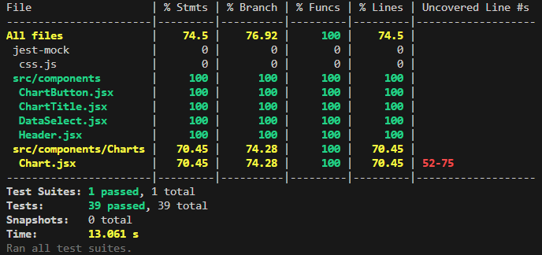

# Development

## Unity Dashboard

Our system requires [Unity](https://unity3d.com/get-unity/download) and the [HP Omnicept Developer SDK](https://developers.hp.com/omnicept/downloads). In order to download the HP Omnicept Developer SDK, first you must be a part of an organization with permission to access the SDK. You can create a organization within HP's developer portal [here](https://omnicept-console.hpbp.io/xr) once you do you can register an application as shown below.

For Unity, any up-to-date operating system is compatible including Windows 7 SP1+, 8, 10, 64-bit versions only; Mac OS X 10.12+; Ubuntu 16.04, 18.04, and CentOS 7.
HP Omnicept SDK is only compatible with Windows and requires a workaround for other operating systems.

Unity Editor Version 2021.3.11f1 is required to open the project. Unity allows for any IDE to be used for scripting in C#; Visual Studio is recommended for Mac.

### Downloading and setting up the SDK

When on this [page](https://developers.hp.com/omnicept/downloads) click the button marked below to download the SDK


Then go find the executable that was downloaded and run it


After going through the process of verification, the SDK can be accessed and the [documentation](https://developers.hp.com/omnicept/docs) can be followed for installation.

Go through the setup up wizard and accept the terms of service. When you get the point where it asks you what to install keep all options except for the Unreal Engine plugin


Then finally click install.

### Setting up the project locally

The project follows Unity’s default folder structure: Assets, Packages, and ProjectSettings. A .gitignore and README.md are included at the root for version control and presentation. Within the Assets folder are files and folders for the HP Omnisept SDK called Glia.

To open this project locally, pull from this [repo](https://github.com/pfled/peak-vis-unity), open Unity Hub, then go to Open > Add project from disk. Then, select the folder of the cloned project.


The HP SDK assets for Unity Should be in the project already so to add your credentials there will be a tab in the Unity editor labeled HP Omnicept click that then click configure and a new window will pop up where you can add you Client ID and Access key from this [page](https://omnicept-console.hpbp.io/xr/application)


### Running

In order to run the project, click the play button at the top of the Unity Editor pane. While playing, the HP SDK will create a separate pop-up that can be used to simulate user input such as a change in eye gaze or heart rate.


While you are running the application you can use the HP Omnicept Simulator that came with the SDK to send data to the application without needing a headset. The application can be found by searching in the Windows start menu. To actually begin to send information you need to hit "Send" or "Repeat" in the bottom left corner of the simulator.


### Configuration

Previously, it was necessary to set the location of the API server in the Unity editor as shown below; this is no longer the case.
This setting is now located in the config file.
The config file is located at `Assets > config.cfg` and is formatted as `key=value`, with one key per line.
It may contain the following options:

- `server_url`
  - This key refers to the base URL of the API server.
  - Default value: `http://127.0.0.1:8080/`
- `auto_login`
  - If set, the application will skip the login menu and automatically use the given value as the user ID when saving session data.
  If not set, the login menu will be shown as usual.
  - Default value: Unset.

See "Building and Debug Mode" below for details on how the config file works with release builds.

<figure>
  <image src="./images/UnityDataStoreUrl.png" alt="Unity-Data-Store-URL-Variable" />
  <figcaption>The old location of the API server URL setting, called <code>Base Url</code> in the image.</figcaption>
</figure>

### Testing

Running unit tests in Unity is done through the Unity Test Runner plugin. IMPORTANT - the HP provided prefab for the Omnicept SDK has caused frequent Unity crashes when running unit tests in `play mode` after the tests have ran, so it is recommended that you disable the HPGlia prefab in the scene before you run the unit tests.

The Test Runner tab may not be visible by default. If this is the case, you can show it via `Window > General > Test Runner` in the top menu.

<figure>
  <image src="./images/UnityTestRunner.png" alt="Unity Test Runner" />
  <figcaption>The Unity test runner.</figcaption>
</figure>

<figure>
  <image src="./images/DisableHPGlia.png" alt="Disabling HPGlia Prefab" />
  <figcaption>Disabling the HPGlia prefab.</figcaption>
</figure>

For most direct testing involving running the HP omnicept simulator to complete the full data upload loop to the webapp, you should select the `Login` scene and login using user information that you created in the webapp under an organization.


### Building and Debug Mode

Building is done via the "Build Settings" option in the "File" menu at the upper-left of the Unity editor.

In the "Build Settings" window, you may change some settings before starting the build.
Most relevant is the "Development Build" toggle; this setting enables some extra debugging functionality in the built executable.
In particular, the simulated camera is enabled in builds made with "Development Mode" enabled.

The config file is *NOT* automatically generated when building. It will be created at runtime if one does not exist, but I strongly suggest that you include a file pre-filled with the default settings for ease of use.
For builds, the `config.cfg` should be located in the `PeakVisualization_Data` directory alongside `data.unity3d` and `boot.config`.

## Web Frontend and API Server

### Requirements

This project can be viewed in any IDE; Visual Studio Code is recommended.

Make you sure you have the correct version of [Docker Desktop](https://www.docker.com/products/docker-desktop/) installed.

Python 3.11 or higher is required for the backend.
Some dependencies (namely Tensorflow 2.15.0) require a version of Python in the range 3.9 to 3.11 (inclusive) specifically, however those requirements should be handled by `pip`.

To open this project locally, pull from this [repo](https://github.com/pfled/peak-vis-webapp).
Or maybe a different repo if it's changed since then, you probably know that better than me.

If you don't have make you can run the command listed in the `Makefile` which is `coverage run -m pytest && coverage report --omit="*/test*`.
If you don't have the requisite packages available on your path, you may need to prepend each command with `python -m` like so: `python -m coverage run -m pytest && python -m coverage report --omit="*/test*"`.
The commands may also be run separately, but bear in mind that `coverage report` does not recalculate the coverage on its own. You must run `coverage run -m pytest` first to update the data.

If you want to run the unit tests without code coverage you can just run `pytest`.


### Running the project

You can run the project by running `docker compose up` in the root directory (that is, the one just above the `backend` and `frontend` folders, where the `docker-compose.yml` is located.)
This will create a Docker container that has an image for a MySQL database, Backend, and Frontend.
When the container is running the output will look something like the screenshot below.
If you recieve and error about a missing .env file, you can create a blank .env file to temporarily relieve this issue. See below for the contents of the .env file.
Matlab and Tensorflow will likely both print a thousand messages during startup; don't worry, as long as the container starts they'll be fine.

If you have issues with the containers not updating when source files are changed, you may need to use `docker compose up --build` to ensure that they are rebuilt before starting. You can also run `docker compose build` to build without starting the containers, if you so choose.


The Frontend will run on port 3000, the Backend will run on port 8080, and the MySQL database will run on port 3306.
To connect to the data do so through a socket connection with the username `peak-vis` and the password `dev`.

If you already have a MySQL server running on your device, it may interfere with the one in the container. If this occurs, close all existing MySQL applications and try again.

You can stop the containers either by pressing `Control + C` in the terminal instance where the `docker compose up` command was run, or via the controls in the Docker Desktop application.

### Frontend

The web app follows React folder structure standards. There is a public folder, a src folder containing components and assets, and files necessary for package management and git tracking. The components folder contains JavaScript files that create different components throughout the application. This is a feature of React that makes frontend code modular and repeatable. (And also severely overcomplicated, but that's a story for another day.)

You can view the frontend in your browser by connecting to `http://localhost:3000`.

To run unit tests use `npm run test` in the `frontend` directory immediately under the project root (that's the one with `package.json` in it.) `npm run test:coverage` should be used to generate test coverage percentages for total statements, branches, functions, and lines in the frontend.



### Backend

The api is built using Flask, a framework for Python. To install all of the dependencies you can run `make install-dev` if you have and use `Make` or you could run the command in the makefile: `pip install -r requirements/common.txt -r requirements/develop.txt` (you can replace `pip` with `pip3` if that is the Python package manager you prefer.)

If you recieve an error regarding building the wheels of MySQL Client, attempt to install [MariaDB Connector](https://mariadb.com/downloads/connectors/), product C Connector and latest version. After installing, copy bin, lib, and include folders of the install to a new folder that you will make called mariadb-connector in the root level of the C: Drive. 

The database can be initialized by running the commands `flask db migrate` then `flask db upgrade` in the command line in the Backend folder which use the `flask-migrate` package to automatically create the database schema defined by `Models` in the api code.

The file structure for the project is as follows:

```text
backend
* api
│   * __init__.py
│   * config.py
│   │
│   * controllers
│   │   
│   * models
│   │ 
│   * blueprints
│   │   
│   └── utils
│   
* requirements
* bin (used for running api in web server)
* migrations (auto generated)
* tests
* wgsi.py (used for running api in web server)
└── setup.cfg (settings for flake8 linting)
```

The `config.py` file contains the code for the main api and Flask settings and the `__init__.py` file in the `api` folder sets up the application. `controllers` is the folder that container the functional code for most of the api endpoints (routes). `utils` contains additional functional code for additional shared behaviour that don't belong in a single controller like checking if JWT tokens are blacklisted. `models` contain data classes that represent tables within the database. It is also necessary to create database migrations. `blueprints` contain the files that define all of the endpoints (routes) in a blueprint which is a Flask construct.

To run the backend api completely you will need to add a `.env` file to the `backend` directory with these variables:

```ini
S3_BUCKET_NAME=testing
AWS_ACCESS_KEY_ID=testing
AWS_SECRET_ACCESS_KEY=testing
DB_CONNECTION=mysql
DB_USERNAME=peak-vis
DB_PASSWORD=dev
DB_HOST=127.0.0.1
DB_NAME=peak-visualization
SECRET_KEY=testing
APP_MODE=dev
```

The `S3_BUCKET_NAME`, `AWS_ACCESS_KEY_ID`, and `AWS_SECRET_ACCESS_KEY` should all be created and found on your AWS account. (Note that these variables are not relevant if you are not using AWS for storage.) `DB_CONNECTION` is the database flavor that you will be using, currently we are using MySQL but you could use whatever other SQL flavor like `PostgreSQL`. Most of the `DB` variables are also set in the `docker-compose.yml` file when defining the database image.

### Note

When you first start after you run the docker compose project you will need to create an admin user to test admin functionality on the frontend and create new users. To do so, you will need to connect to the peak-vis-api container from CLI through the docker dashboard. You will need to run `flask db upgrade` to create the database tables. Then, you will need to run a custom Flask command `flask create-admin --email {your testing email} --password {development password}`.

After creating a sample organization and user, select "View session dashboard" under the user. To add sample sessions, connect to the peak-vis-webapp-mysqldb database container from CLI. Run `mysql -h localhost -u peak-vis -pdev peak-visualization` to connect the mysql server to the container. Sample data can then be added by running commands such as `insert into datasets(name, user_id) values ("2023-02-03T17:10:29.224Z.json",2);`. Sample data may also be uploaded directly from the Unity dashboard; this is the easiest way to get video on there.

## Linting

### Frontend

The frontend is setup with ESLint/Prettier
To run the code formatter i.e. Prettier type the command `npm run format` in the root directory and this will run `prettier --write` on the entire project.
There are two main commands for ESLint: `npm run lint` which will just run the basic ESLint command and `npm run lint:fix` which will run some automated fixes.

### Backend

The backend uses Flake8 for linting.
There are a couple ways to run the linter depending on preference:

- If you have `Make` can run the command `make lint` the Flake8 command
- If you do not use `Make` you can just run the command in the file which is `flake8 api --count --show-source --statistics`.
This will lint only the `api` folder becasue it contains the main code for the api. If you want strictly enforce the linting rules on the entire backend directory you can just run `flake8` in the backend directory.

### Unity Dashboard

The Unity dashboard implements Stylecop for formatting rules and SonarLint for linting.
Both are implemented as NuGet packages that run in Visual Studio 2022.
Neither implement auto-fix with a single command, but errors will be caught as they are typed and VS will provide warnings.
Specific rules can be configured in the `.editorconfig` file.

## Third party dependencies

### Frontend

- cross-env
- recharts
- eslint
- html2canvas
- isomorphic-fetch
- jspdf
- moment
- prettier
- react
- react-csv
- react-dom
- react-icons
- react-pdf
- react-router-dom
- react-router
- react-select
- jest
- web-vitals
- viject

### Backend

Production and dev

- Flask
- Gunicorn
- Flask-Migrate
- Flask-SQLAlchemy
- PyJWT
- flask-jwt-extended
- mysqlclient
- cmake
- flask-bcrypt
- JSONSchema
- flask-cors
- fer

Dev only

- pytest
- coverage
- flake8
- python-dotenv
- pytest-dotenv
